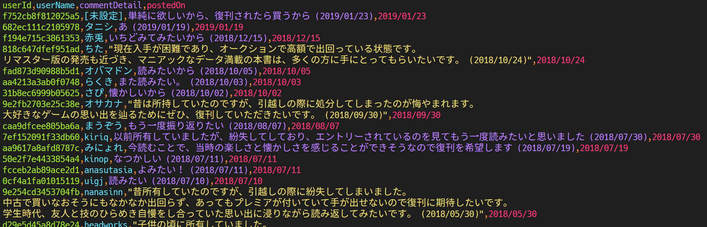

# Fetch Fukkan Comments
- 復刊ドットコムの復刊投票コメントを取得する
  - 取得した内容を CSV ファイルとして書き出す

# 必要ライブラリ
- [Playwright](https://playwright.dev/) で Webブラウザ を動かすために必要なライブラリが必要になる
- 必要ライブラリが入っていない状態で実行すると、たとえば以下のようなエラーメッセージが出る

```bash
$ fukkan_comments --book 2728 --page 5 --output comments.csv
node:internal/process/promises:288
            triggerUncaughtException(err, true /* fromPromise */);
            ^

browserType.launch:
╔══════════════════════════════════════════════════════╗
║ Host system is missing dependencies to run browsers. ║
║ Please install them with the following command:      ║
║                                                      ║
║     sudo npx playwright install-deps                 ║
║                                                      ║
║ Alternatively, use apt:                              ║
║     sudo apt-get install libatk1.0-0\                ║
║         libatk-bridge2.0-0\                          ║
║         libcups2\                                    ║
║         libxkbcommon0\                               ║
║         libxdamage1\                                 ║
║         libgbm1\                                     ║
║         libpango-1.0-0\                              ║
║         libcairo2\                                   ║
║         libatspi2.0-0                                ║
║                                                      ║
║ <3 Playwright Team                                   ║
╚══════════════════════════════════════════════════════╝
```

# 使い方
- 対象の本のページの URL から `book_number` を取得する
  - 例えば `https://www.fukkan.com/fk/VoteDetail?no=2728` という URL の場合は `book_number` は `2728` になる
- `fetch-fukkan-comments` を npm でインストールし、`book_number` と `page` と `output` の引数を指定してコマンド実行する
  - `page` はコメントのページ番号になる
    - 並び順は「新しい順」のときのページ番号になる
  - `output` は出力する CSV のファイルパスになる

```bash
$ npm install -g fetch-fukkan-comments
```

```bash
$ fukkan_comments --help
Usage: fukkan_comments [options]

Options:
  -V, --version             output the version number
  -b, --book <book_number>  Book number
  -p, --page <page_number>  Page number (default: "1")
  -o, --output <filepath>   Output filepath (default: "fukkan_comments.csv")
  -h, --help                display help for command
```

```bash
$ fukkan_comments --book 2728 --page 2 --output /tmp/fukkan_comments.csv
```

# 使い方（リポジトリを clone した場合）

```bash
$ ./fukkan_comments.js --book 2728 --page 2 --output /tmp/fukkan_comments.csv
```

# CSV ファイルの例


# 資料

## Bookページ の URL
- https://www.fukkan.com/fk/VoteComment/[:bookNo]?no=[:bookNo]&page=1&s=date

## Userページ の URL
- https://www.fukkan.com/fk/user/?no=[:userId]
